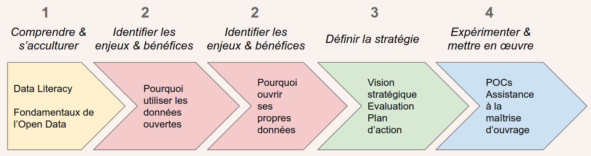

layout: true
  

Datactivist - Open Belgium
 

---

class: center, middle

Ces slides en ligne : http://datactivist.coop/openbelgium/

Sources : https://github.com/datactivist/openbelgium

Les productions de Datactivist sont librement réutilisables selon les termes de la licence [Creative Commons 4.0 BY-SA](https://creativecommons.org/licenses/by-sa/4.0/legalcode.fr).

 
 

---
## Qui sommes nous ?

    

### We .red[open data], we make them .red[useful]

---
## Qui sommes nous ?

- Datactivist est un pure player de l’open data créé en 2016, par Samuel Goëta et Joël Gombin.
- Se positionnant sur toutes les étapes du travail d’ouverture des données, Datactivist travaille tant avec les producteurs de données qu’avec les réutilisateurs et participe à l’appropriation des données par chacun.
- Nous appliquons nos propres valeurs : nous sommes une coopérative ; nos supports de formation et nos contenus sont librement réutilisables, publiés en licence Creative Commons.
- Nous animons la communauté [#TeamOpenData](https://teamopendata.org).

---
## Nos activités

#### Conseil sur les .red[stratégies d’ouverture de données] : nous aidons les organisations dans la conception et la mise en œuvre de leur stratégie d’ouverture de données.

#### .red[Accompagnement dans la réutilisation de données ouvertes] : nous aidons les organisations à utiliser les données au quotidien. 

#### .red[Sensibilisation et formation à la donnée] : nous formons à la culture générale des données, nous enseignons les grands principes et bonnes pratiques de l'open data et nous introduisons à la data science. 

#### .red[Médiation de données] : nous organisons des hackathons, des open data camps, des expéditions de données...

---
## Notre vision

### D'un open data de l'offre à un .red[open data de la demande]

Aujourd’hui, les administrations choisissent les données à ouvrir, elles décident du quand et du comment .red[**sans consulter les usagers**].

Les rares données ouvertes sont souvent décevantes : pas à jour, trop agrégées, mal documentées, mal formatées, parfois inutilisables. 

Il faut aujourd’hui passer à l’étape supérieure : .red[**un open data piloté par la demande**].

---
## Ouvrir ses données : les étapes

---
## Réussir sa stratégie d'ouverture des données 

- Au-delà de l'obligation légale : .red[poser les objectifs] poursuivis par la stratégie

- Se donner les moyens de connaître la .red[demande de données] pour y répondre (voir par ex. [DODOdata.io](https://dododata.io))

- Travailler à la .red[qualité des données], garante d'usages réels

???

Une stratégie qui peut/doit englober la question de la data en général§.
Croiser aussi avec le RGPD ! 

---
## Réussir sa stratégie d'ouverture des données 

- Une ouverture des données .red[orientée vers l'utilisateur] : pousser les données là où sont les usagers et non l'inverse

- Construire une .red[offre de services] pour son écosystème (public et privé)

- Distinguer ouverture de ses données, et infrastructures de partage des données

???

Le premier est le métier de l'acteur public, le deuxième l'est-il ? Quelle gouvernance des plateformes d'ouverture des données ?

---
## Réussir sa stratégie d'ouverture des données 

- Aller vers un service métropolitain de la donnée

- Poser la question des données d'intérêt général

- Réarmer le service public à l'heure de la révolution des données : big data, algorithmie... 

---
class: inverse, center, middle

# Merci !

Contact : [joel@datactivist.coop](mailto:joel@datactivist.coop)

